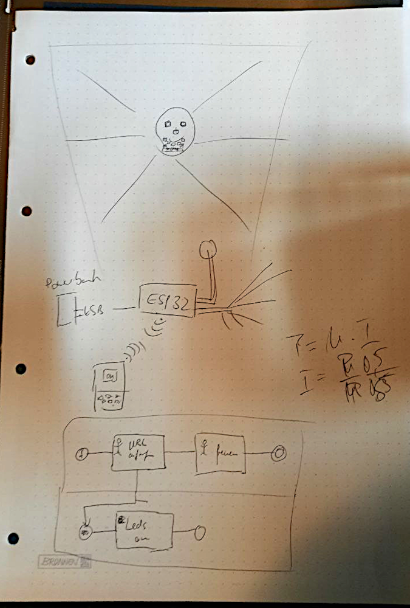
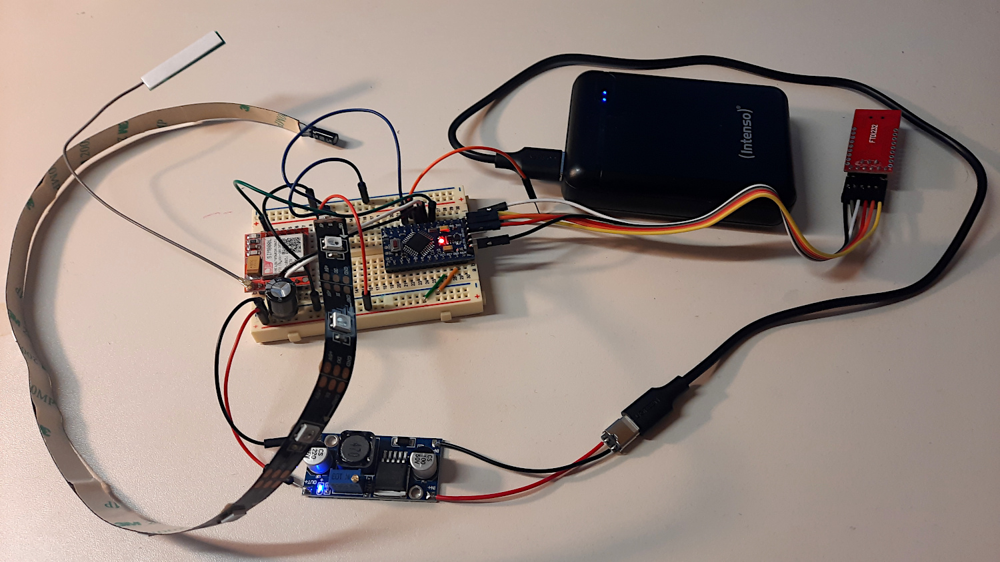
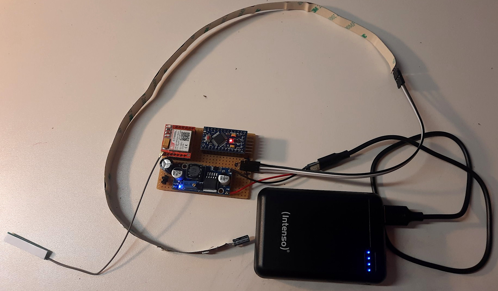
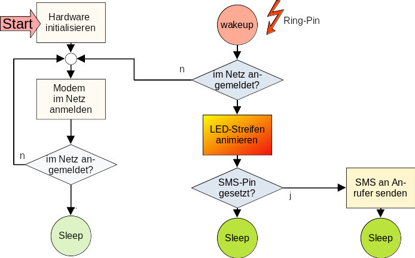
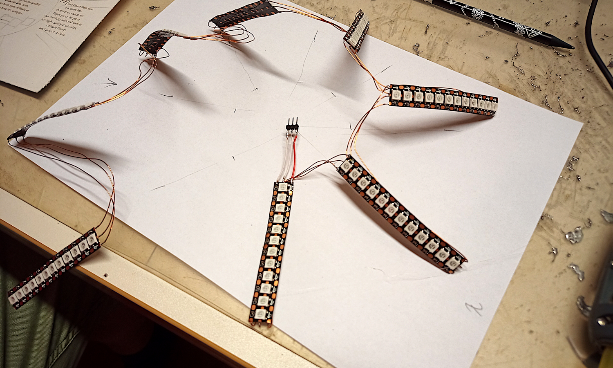
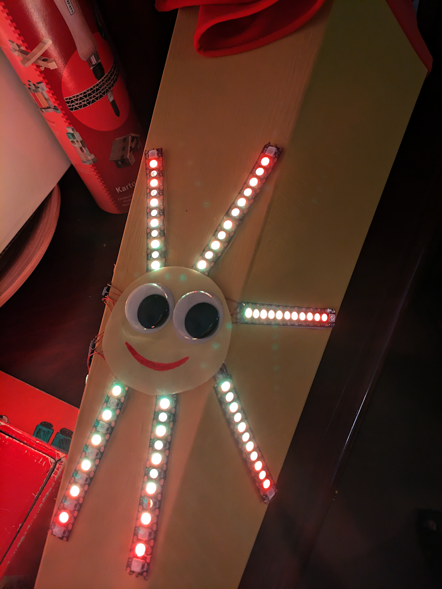

# Ingos Sonne

## Motivation

Ingo wollte eine Sonne aus LEDs auf einer Schultüte. Die Sonne sollte ferngesteuert einschaltbar sein. Nach einigen Diskussionen meinten wir, dass die Fernsteuerung der LEDs über das Handy-Netz am sichersten wäre:

* es ist nicht sichergestellt, dass im entscheidenen Moment entsprechender Sichtkontakt zur Schultüte besteht--> IR-Fernbedienung o.ä. verworfen
* bei Bluetooth, Zigbee o.ä. könnte die Reichweite und die Umgebung schon eine Rolle spielen --> verworfen
* WLAN vielleicht, aber "wer WLAN kennt, nimmt Kabel" oder so ähnlich; es könnte auch zu Engpässen bei der Stromversorgung kommen... --> verworfen
* auch in Deutschland sollte es, zumindestens in Städten, ein flächendeckendes Handy-Netz gegeben sein ***--> das probieren wir!!!***

Der "originale Bierdeckel", hier noch mit der WLAN-Variante als Fernsteuerung:

## Hardware

**Ok, was brauchen wir:**

* ein GSM-Modem (und eine entsprechende SIM-Karte ;-)) --> SIM800L
    * [Datasheet SIM800L](https://www.makershop.de/download/Datasheet_SIM800L.pdf)
    * [Pinout SIM800l-Modul](https://www.makershop.de/download/SIM800L-GSM-Pinout.jpg)
    * [AT-Kommandos SIM800L](https://raspberry-pi.fr/download/SIM800%20Series_AT%20Command%20Manual_V1.09.pdf)
* einen Mikrocontroller ATMega328 (Arduino Nano oder Mini Pro) zur:
    * Ansteuerung des GSM-Modems
    * Warten/Reaktion auf/bei Anruf
    * Ansteuerung des LED-Streifens
* RGB-LED-Streifen (WS2812)
* eine entsprechend dimensionierte Stromversorgung
    * LM2596
        * ideale Spannung des GSM-Modem ca. 4,2V
        * es gibt Stromspitzen bis zu 2A; deshalb auch noch ein Elko (470uF) direkt am GSM-Modem
    * eine Powerbank mit ausreichender Kapazität und die mit niedrigen Ladeströmen irgendwie "sinnvoll" umgehen kann
 

**Schaltung mit Arduino Mini Pro:**

**Testaufbau:**

 

**Entgültige Zielhardware:**

...welche dann auch tatsächlich in die Schultüte eingebaut wurde, ...natürlich nicht mit dem Test-LED-Streifen, welcher auf dem Bild zu sehen ist.

 

## Firmware Mikrocontroller

Was muss die Firmware können, welche "Sonderlocken" sind implementiert:

* Hardware, vor allem SIM800L, initialisieren; Verbundungsaufbau ins Handy-Netz
* Konfiguration Interrupt, wenn GSM-Modem angerufen wird (RING-Pin)
* bei Interrupt Unterscheidung ob Anruf oder SMS:
    * je nach Konfiguration (via Define im Quelltext) löst ein Anruf und/oder eine SMS die Animierung des LED-Streifens aus
    * je nach Konfiguration (via Jumper/Switch) antwortet das System dem Anrufer mit einer SMS
* wenn eine Verbindunsunterbrechung zum Handy-Netz erkannt wird (ebenfalls via RING-Pin), neuer Verbundungsaufbau
 
 

## Die Sonnenstrahlen...

...wurden mit Kupferlackdraht entsprechend verbunden. Dieses Gesamtkonstrukt wurde mit Heißkleber auf der Schultüte angebracht.

Die Elektronik und Stromversorgung verschwand im Inneren der Schultüte...

## Das Endergebnis

Hier nur als Standbild:

Es existieren selbstverständlich auch bewegte Bilder von der Schultüte und dem glücklichen Erstklässler...

-----
Have fun!

Uwe Berger, 2024

